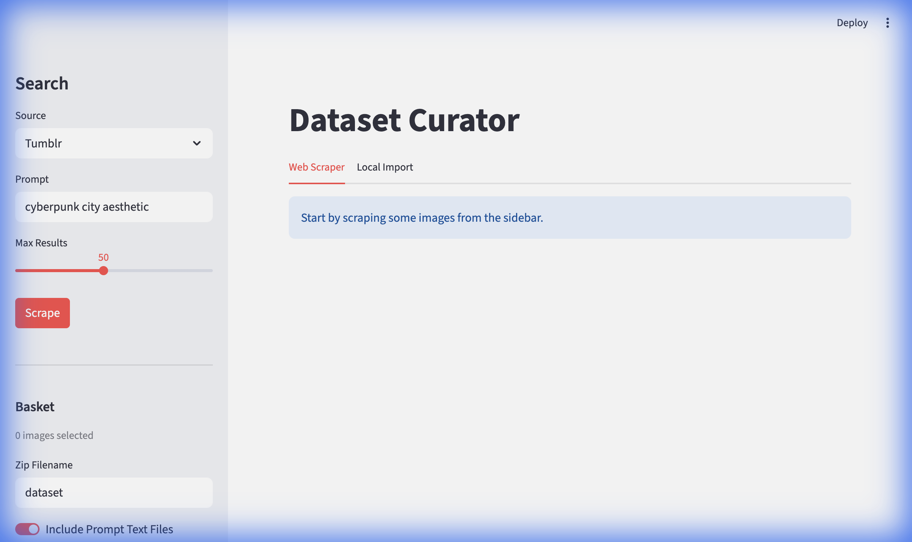
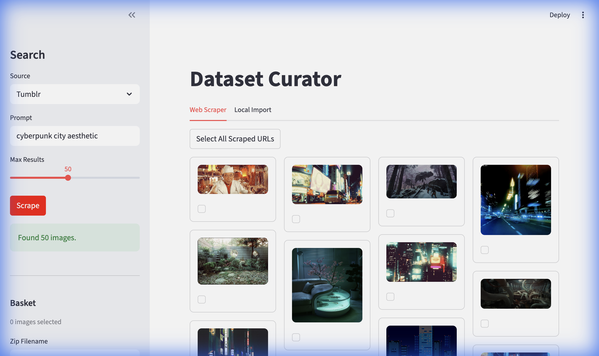

# Dataset Curator AI

A powerful tool to scrape, curate, and export image datasets using semantic similarity. Built with Streamlit and Playwright.



## Features

- **Multi-Source Scraping**: Scrape images from Tumblr, Pinterest, and Google Images.
- **Smart Curation**: Use semantic similarity to find images that match the "vibe" of your selected favorites.
- **Local Import**: Easily import your own images or zip files.
- **Export**: detailed "Basket" system to review your selection and export as a dataset zip file (including prompts).



## Access the App

You can use the deployed version of the application directly in your browser:

👉 **[datasetcurator.streamlit.app](https://datasetcurator.streamlit.app)**

## Running Locally

If you prefer to run the tool on your own machine, follow these steps:

### Prerequisites
- Python 3.8+
- Git

### Installation

1. **Clone the repository:**
   ```bash
   git clone https://github.com/k4ysam/Dataset-Curator.git
   cd Dataset-Curator
   ```

2. **Install dependencies:**
   ```bash
   pip install -r requirements.txt
   ```

3. **Install Playwright browsers:**
   This tool uses Playwright for scraping, which requires browser binaries.
   ```bash
   playwright install
   ```

4. **Run the application:**
   ```bash
   streamlit run app.py
   ```

The app should open automatically in your default browser at `http://localhost:8501`.

## How to Use

1. **Search & Scrape**: Use the sidebar to select a source (Tumblr, Pinterest, etc.) and enter a search query. Click "Scrape".
2. **Select Images**: Click "Select" on images you like to add them to your Basket.
3. **Find Similar**: (Local Mode) For local images, you can use the "Similar" button to sort your collection based on visual similarity to a target image.
4. **Export**: Go to the sidebar, review your basket, and click "Export Dataset" to download a zip file containing your verified images and captions.
